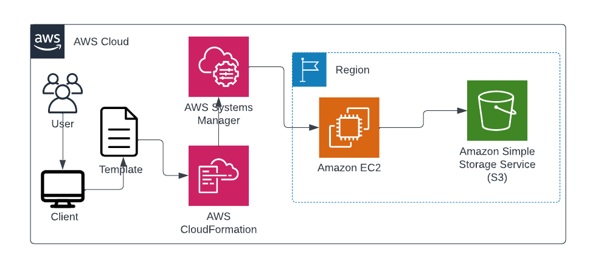
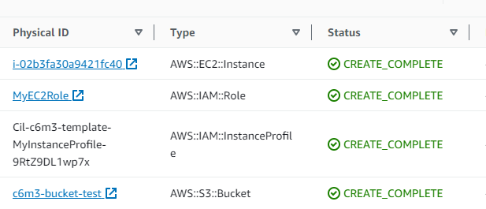
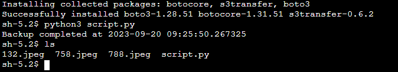
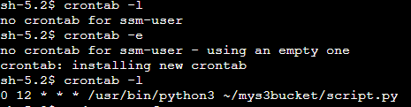

# Cil-Academy C6M3 Task

This project contains an AWS infrastructure solution that uses CloudFormation to create a stack, launching a t2.micro EC2 instance with the Amazon Linux 2 AMI and an S3 bucket.

## Architecture

## Overview

- The EC2 instance is assigned a role that allows access through the Session Manager (SSM) instead of traditional SSH key-pair authentication.

- The EC2 instance serves as a backup location for images uploaded to the S3 bucket.

- A Python script is implemented to automate the process of copying S3 content to the EC2 instance's backup directory.

- A cronjob is set up to execute the Python script daily at 12:00 AM, ensuring automated backup operations.

## Technologies Used

- **Boto3**: Python library serving as the AWS SDK for communication with AWS resources.
- **OS Library**: Python built-in library used to interact with the operating system.
- **CloudFormation Stack**: A configuration file containing a collection of AWS resources managed as a single unit when deployed.
- **AWS CLI**: AWS Command Line Interface for interaction with AWS services and resources.

## Project Workflow
The project is structured into three main stages:

- **CloudFormation Stack:** In this initial stage, create the stack and deploy it, either through the AWS console or the command-line interface (CLI), to create your predefined AWS resources. You can find the code for the CloudFormation stack in the `CFN.yml` file.

- **Object Upload to S3:** Upload some images or files to the S3 bucket that was created as part of the stack.  

> aws s3 cp 788.jpeg s3://c6m3-bucket-test
> aws s3 cp 758.jpeg s3://c6m3-bucket-test
> aws s3 cp 132.jpeg s3://c6m3-bucket-test

- **Python Script:** The Python script (script.py) is responsible for copying the S3 content to the EC2 instance, effectively creating a backup. Ensure that the required Python libraries are installed on your instance for the script to run successfully.

- **Cronjob:** To automate the Python script's execution, set up a cronjob to run the script daily at 12:00 PM. PS- you need to install cronie to run cronjobs `sudo yum install cronie`

## Challenges Faced
- Initially, understanding CloudFormation was challenging, but with dedicated documentation reading, I quickly grasped the concepts and best practices.

- Another obstacle I encountered was executing the script on the EC2 instance. I realized that I needed to install the necessary Python libraries on the instance to resolve the errors.

use this code if you run into problem `sudo yum install python3-pip` before `pip3 install boto3`
